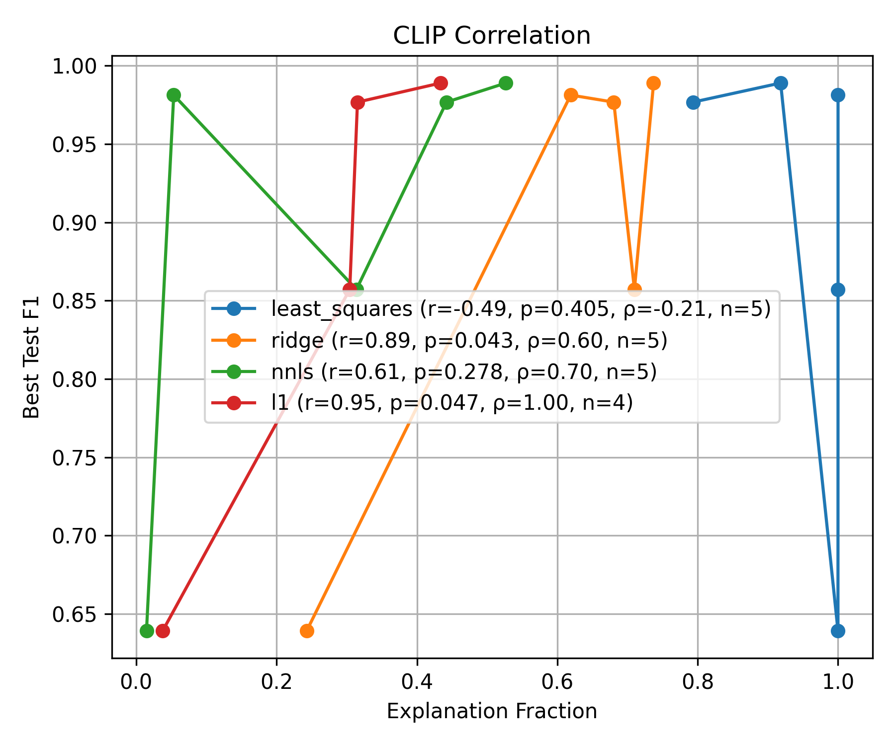
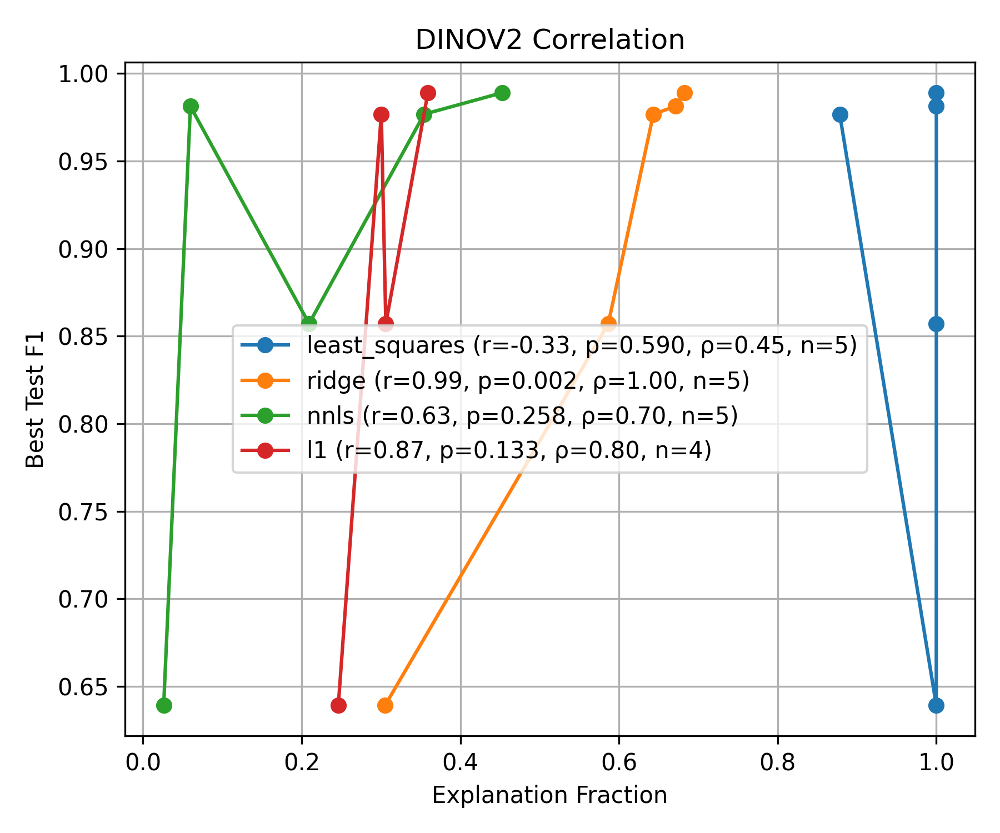
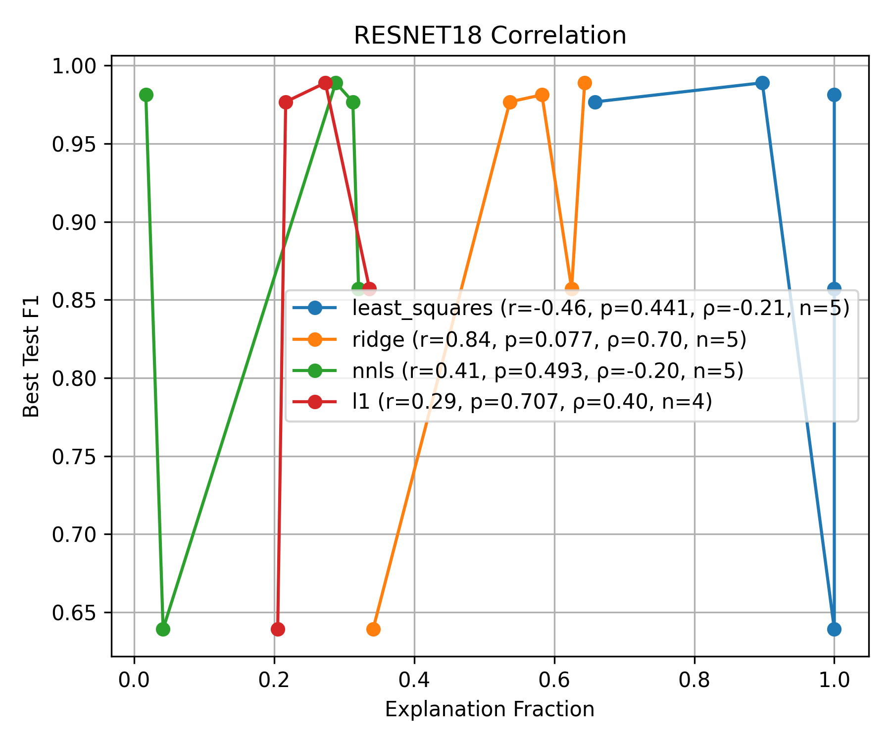

# Discriminative Span As A Predictor Of Synthetic Data Utility Via Classifier Reconstruction

Official implementation for the paper:

**Discriminative Span As A Predictor Of Synthetic Data Utility Via Classifier Reconstruction**  
📄 Paper: https://arxiv.org/pdf/2605.09697

---

## Introduction

Synthetic data is widely used to address data scarcity in computer vision, particularly in domains such as medical imaging and industrial inspection. However, evaluating whether synthetic data will actually improve downstream model performance remains a major challenge.

Current evaluation pipelines typically require:

- training downstream models,
- performing extensive experiments,
- and repeating evaluations across architectures and datasets.

These approaches are computationally expensive and often provide little insight into *why* certain synthetic data improves performance while others fail.

In this work, we propose a geometric alternative.

Instead of evaluating synthetic data through downstream training, we analyze whether the transformations induced by synthetic samples align with the **discriminative direction** of the target task in representation space.

Our central hypothesis is:

> Synthetic data is useful when the variations it introduces span the task-relevant discriminative direction.

To study this, we introduce **Discriminative Span (DS)** — a geometry-driven metric that measures how well a classifier direction can be reconstructed from the span of synthetic-data-induced difference vectors.

---

## 🧠 Key Idea

Given paired real and synthetic samples:

```math
d_i = x_i^{(synthetic)} - x_i^{(real)}
```

we construct a difference matrix:

```math
D \in \mathbb{R}^{n \times d}
```

We then ask:

> Can the classifier direction $w$ be reconstructed from the span of these difference vectors?

Formally:

```math
D^T \alpha \approx w
```

We define the relative projection error:

```math
RPE = \frac{||w - w_{proj}||_2}{||w||_2}
```

and define:

```math
DS = 1 - RPE
```

High Discriminative Span indicates that synthetic transformations capture task-relevant directions in embedding space.

---

### Method Pipeline


---

## 📊 Main Findings

Our experiments reveal several key insights:

- Strong correlation between Discriminative Span and downstream test F1 score
- Ridge and NNLS estimators achieving Pearson correlations up to **0.98**
- Global diversity alone is insufficient for generalization
- High-performing datasets often exhibit low-dimensional but highly aligned transformation structure
- Foundation-model embeddings (CLIP, DINOv2) provide substantially stronger geometric signals than standard supervised CNN embeddings

Our results suggest:

> Generalization is governed not by the amount of variation, but by its alignment with the discriminative direction.

---

## Correlation Between Discriminative Span and Test Performance

The following plots show the relationship between **Discriminative Span** and downstream **Test F1 Score** across different embedding spaces.

We observe strong positive correlation for regularized estimators, particularly in **CLIP** and **DINOv2** embedding spaces, supporting the hypothesis that geometric alignment predicts downstream generalization.

---

### CLIP Embedding Space

<p align="center">
  
</p>

---

### DINOv2 Embedding Space

<p align="center">
  
</p>

---

### ResNet-18 Embedding Space

<p align="center">
  
</p>

---

Example correlations observed in the paper:

| Embedding Space | Solver | Pearson r |
|---|---|---|
| CLIP | Ridge | 0.924 |
| CLIP | NNLS | 0.958 |
| DINOv2 | Ridge | 0.981 |
| DINOv2 | NNLS | 0.980 |
| ResNet-18 | Ridge | 0.774 |
| ResNet-18 | NNLS | 0.734 |

---

## Geometric Interpretation

The proposed framework treats synthetic data evaluation as a geometric alignment problem.

Instead of measuring:
- photorealism,
- diversity,
- or perceptual similarity,

we directly evaluate whether synthetic transformations span the **decision boundary direction** required for the downstream task.

This provides:
- a computationally efficient proxy for downstream utility,
- interpretable geometric diagnostics,
- and insight into why certain synthetic datasets generalize better than others.

---

## ⚙️ Installation

Create a virtual environment:

```bash
python -m venv venv
```

Activate the environment.

### Linux / MacOS

```bash
source venv/bin/activate
```

### Windows

```bash
venv\Scripts\activate
```

Install dependencies:

```bash
pip install -r requirements.txt
```

---

# 🚀 Running The Experiments

## 1. Generate Embeddings

Generate embeddings using pretrained or foundation models.

### Command

```bash
python generate_embeddings.py --config <config_path>
```

---

## 2. Difference Vector Consistency Analysis

Runs consistency and directional alignment diagnostics on embedding-space difference vectors.

### Command

```bash
python difference_vector_consitency_analysis.py --dataset_root <path_to_embeddings>
```

---

## 3. Linear Combination / Span Reconstruction Analysis

Evaluates whether classifier directions can be reconstructed from the span of synthetic-data-induced variations.

### Command

```bash
python linear_combination.py --config <config_path>
```
---

## 4. Matrix Rank Analysis

Performs spectral, rank, and conditioning analysis on the difference matrix.

### Command

```bash
python matrix_rank_analysis.py --input_dir <embedding_root> --output_csv <output_csv_path>
```

---

## Supported Embedding Models

Current embedding extraction support includes:

- DINOv2
- CLIP
- ResNet18
- EfficientNet-B0
- MobileNetV2

---

## 🧪 Experimental Datasets

The paper evaluates the framework across multiple datasets:

- Pneumonia Chest X-ray (CXR)
- Skin Lesion
- Horses ↔ Zebras
- Apples ↔ Oranges
- Toy Watermark Dataset

---

## 💡 Important Observations

### 1. Diversity Alone Is Not Enough

Datasets with high effective rank do not necessarily generalize well.

The critical factor is whether the induced transformations align with the discriminative direction.

---

### 2. Ill-Conditioning Is Often Meaningful

High-performing datasets frequently exhibit:
- strong linear dependencies,
- low-dimensional structure,
- and highly concentrated variation.

This suggests that useful synthetic transformations are often geometrically structured rather than uniformly diverse.

---

### 3. Regularization Matters

Naive least-squares reconstruction often produces:
- unstable solutions,
- saturated explained fractions,
- and weak correlation with downstream performance.

Ridge regression consistently provides more stable and meaningful estimates.

---

## 🔮 Future Directions

Potential future extensions include:

- nonlinear reconstruction methods,
- feedback-driven synthetic data generation,
- robustness-aware geometric metrics,
- active discovery of underrepresented transformation directions,
- and analysis in multimodal embedding spaces.

---

## 📚 Citation

If you find this work useful, please consider citing:

```bibtex
@article{desai2026discriminativespan,
  title={Discriminative Span As A Predictor Of Synthetic Data Utility Via Classifier Reconstruction},
  author={Desai, Radhika Amar and Narendra, Modigari},
  journal={arXiv preprint arXiv:2605.09697},
  year={2026}
}
```

---

## 🙏 Acknowledgements

We thank the open-source community and the authors of:

- PyTorch
- scikit-learn
- CLIP
- DINOv2
- CycleGAN

for making this work possible.

---

## References

This repository builds upon ideas from:
- representation learning,
- linear probing,
- latent-space arithmetic,
- synthetic data generation,
- and geometric analysis in embedding spaces.

Please refer to the paper for the complete bibliography.